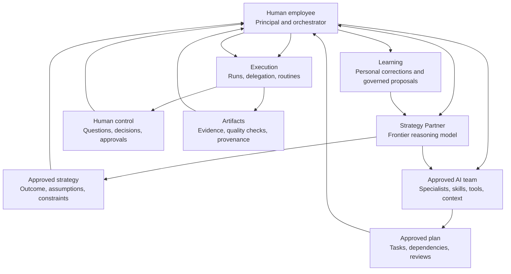
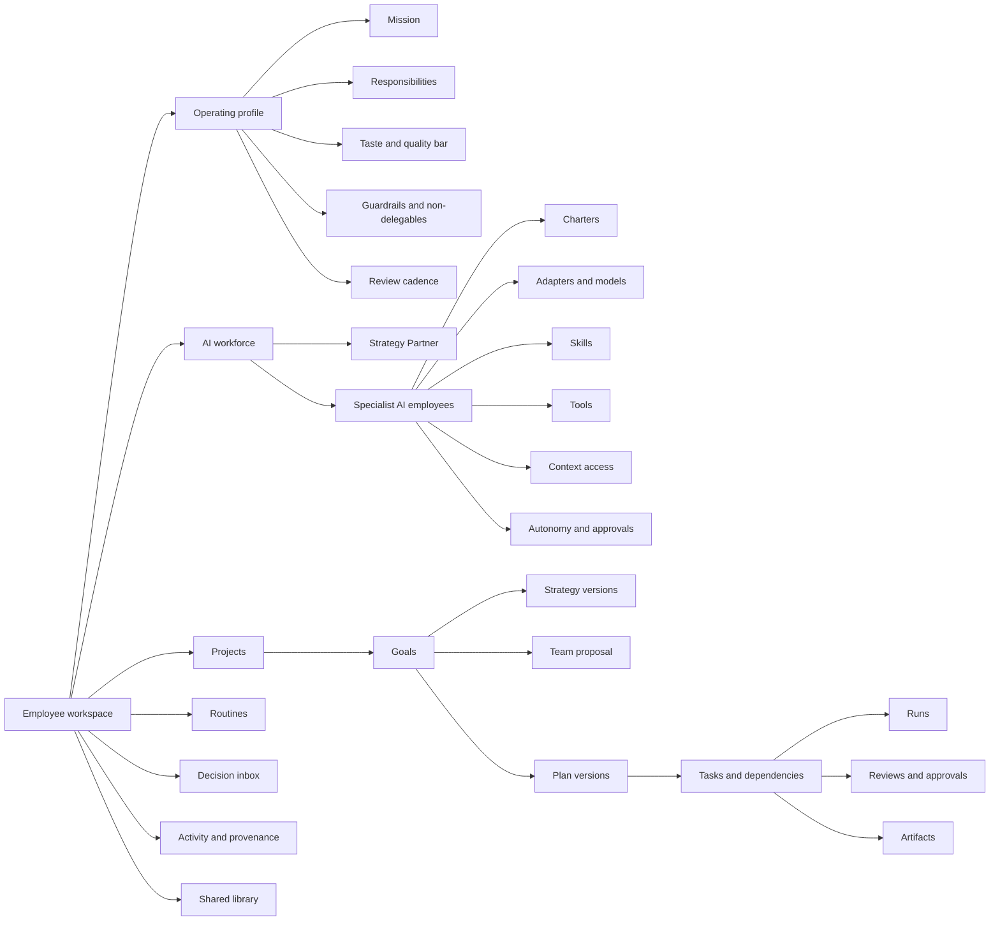
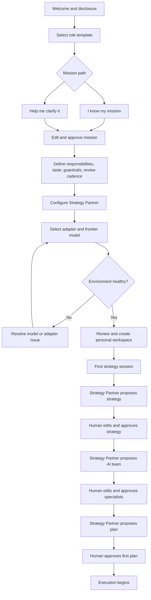
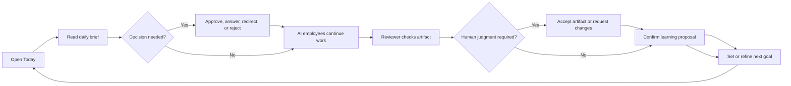
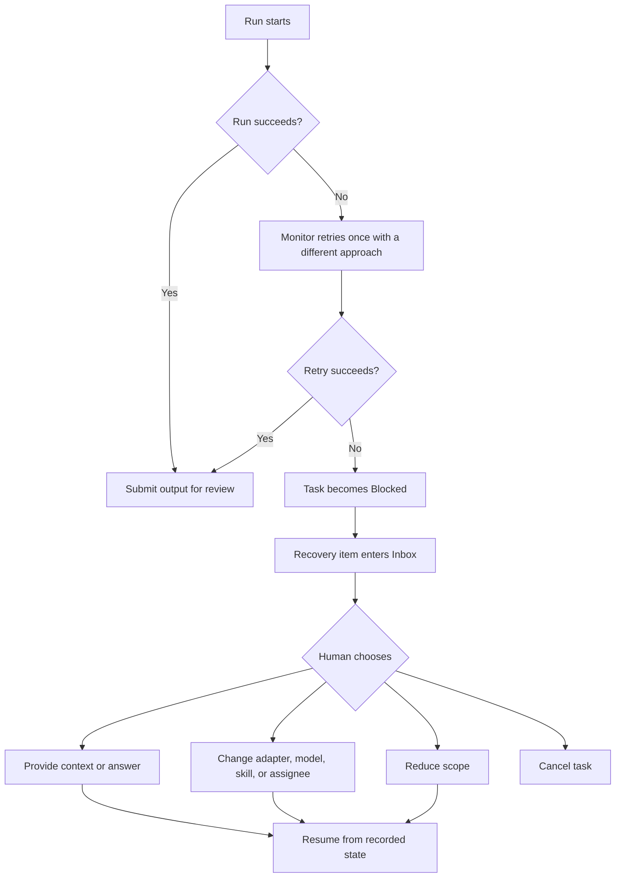

# Algolia AI Workforce: Information Architecture and User Journey

**Status:** Product design definition
**Date:** 24 July 2026
**Source:** `prd-algolia-agent-workbench.md` and direct exploration of the local agent-management experience
**Scope:** Desktop-first functional prototype using synthetic data and simulated AI execution

## 1. Experience definition

Algolia AI Workforce is a personal operating system for an employee and their AI workforce.

The human employee is the principal and orchestrator. They use a frontier Strategy Partner to clarify objectives, challenge assumptions, form strategy, recommend the required AI team, and turn approved direction into executable work.

The product must help the employee answer five questions:

1. **What are we trying to achieve?**
2. **Which AI capabilities do I need?**
3. **What work is happening, and why?**
4. **Where is my judgment required?**
5. **What did we produce and learn?**

The interface should organise itself around those questions rather than around model providers or chat sessions.

## 2. Core experience model



### Ownership model

| Activity | Human employee | Strategy Partner | Specialist AI employees | System |
|---|---|---|---|---|
| Define intent and desired outcome | Owns | Clarifies and challenges | Consulted when useful | Records |
| Form strategy | Accountable and approves | Drafts options and recommendations | Supplies specialist analysis | Versions decisions |
| Design the AI team | Approves composition and autonomy | Recommends capabilities and roles | Not active until approved | Enforces policy |
| Create the execution plan | Approves material scope | Decomposes strategy | Estimates specialist work | Creates versioned plan |
| Execute tasks | Supervises and redirects | Coordinates approved work | Performs bounded execution | Schedules and records |
| Judge quality | Owns taste and final judgment | Prepares decision | Reviewer checks criteria | Preserves evidence |
| Take consequential action | Approves | Recommends | Prepares action | Enforces approval gate |
| Learn from corrections | Confirms | Proposes updates | Contributes observations | Applies approved changes |

## 3. Product object hierarchy

The architecture must distinguish stable employee context from temporary execution.



### Object distinctions

| Object | Meaning | Lifetime |
|---|---|---|
| Operating profile | Who the employee is, what they own, and how they judge work | Long-lived |
| Mission | Why the employee uses an AI workforce and the outcomes it should support | Long-lived, revisable |
| Goal | A specific, time-bound outcome | Weeks or months |
| Strategy | The chosen approach to a goal | Versioned when direction changes |
| Team proposal | Capabilities required for a goal | Goal-specific or reusable |
| AI employee | A persistent role with a charter and work history | Long-lived until paused or archived |
| Plan | Approved decomposition of strategy into work | Versioned |
| Task | Auditable unit of execution | Until completed or cancelled |
| Run | One execution attempt | Immutable history |
| Routine | Recurring definition that creates tasks | Long-lived |
| Artifact | Durable evidence-backed output | Long-lived |
| Decision | Human judgment that changes or unblocks work | Immutable history |

## 4. Navigation architecture

The navigation should reflect how employees manage work, not how an AI company is organised.

### 4.1 Recommended global navigation

#### Primary

1. **Today**
2. **Strategy**
3. **Goals**
4. **Work**
5. **AI Team**
6. **Library**
7. **Artifacts**

#### Persistent utilities

- **Inbox**
- **Activity**
- **Search**
- **Pause all AI work**
- **Settings**

### 4.2 Navigation rationale

| Destination | Employee question | Primary content |
|---|---|---|
| Today | What happened, and where am I needed? | Brief, active goals, decisions, blocked work, recent artifacts |
| Strategy | What am I responsible for, and how will AI support me? | Mission, operating profile, quality bar, guardrails, decision principles |
| Goals | What outcomes are we pursuing? | Goals, strategies, team proposals, plans, progress |
| Work | What is being executed? | Tasks, dependencies, routines, runs |
| AI Team | Who is doing the work? | Team map, AI employees, charters, proposals, status |
| Library | How do agents work, and what may they use? | Skills, context, tools, approved templates |
| Artifacts | What useful work exists? | Briefs, prototypes, reports, evidence, reviews |
| Inbox | What needs my judgment? | Approvals, questions, blockers, failures, reviews |
| Activity | What happened and why? | Human, agent, task, run, and system history |
| Settings | How is this workspace governed? | Models, autonomy defaults, notifications, simulation, disclosure |

### 4.3 Sitemap

```mermaid
flowchart TD
    ROOT["Algolia AI Workforce"]

    ROOT --> TODAY["Today"]
    TODAY --> BRIEF["Daily brief"]
    TODAY --> FOCUS["Current focus"]
    TODAY --> DECISIONS["Decisions required"]
    TODAY --> HEALTH["AI team health"]

    ROOT --> STRATEGY["Strategy"]
    STRATEGY --> PROFILE["My role and responsibilities"]
    STRATEGY --> MISSION["Mission"]
    STRATEGY --> TASTE["Taste and quality bar"]
    STRATEGY --> BOUNDARIES["Guardrails and non-delegables"]
    STRATEGY --> PRINCIPLES["Decision principles"]
    STRATEGY --> DLOG["Decision log"]

    ROOT --> GOALS["Goals"]
    GOALS --> GLIST["Goal list"]
    GOALS --> GDETAIL["Goal workspace"]
    GDETAIL --> GOVER["Overview"]
    GDETAIL --> GSTRAT["Strategy"]
    GDETAIL --> GTEAM["Team"]
    GDETAIL --> GPLAN["Plan"]
    GDETAIL --> GWORK["Work"]
    GDETAIL --> GART["Artifacts"]
    GDETAIL --> GDEC["Decisions"]
    GDETAIL --> GACT["Activity"]

    ROOT --> WORK["Work"]
    WORK --> TASKS["Tasks"]
    WORK --> ROUTINES["Routines"]
    WORK --> RUNS["Runs"]

    ROOT --> TEAM["AI Team"]
    TEAM --> TMAP["Team map"]
    TEAM --> DIRECTORY["AI employee directory"]
    TEAM --> PROPOSALS["Team proposals"]
    TEAM --> ADETAIL["AI employee detail"]

    ROOT --> LIBRARY["Library"]
    LIBRARY --> SKILLS["Skills"]
    LIBRARY --> CONTEXT["Context"]
    LIBRARY --> TOOLS["Tools"]
    LIBRARY --> TEMPLATES["Role and workflow templates"]

    ROOT --> ARTIFACTS["Artifacts"]
    ROOT --> INBOX["Inbox"]
    ROOT --> ACTIVITY["Activity"]
    ROOT --> SETTINGS["Settings"]
```



### 4.4 Suggested route structure

```text
/labs/ai-workforce
  /onboarding
  /today
  /strategy
  /goals
  /goals/:goalId
    /overview
    /strategy
    /team
    /plan
    /work
    /artifacts
    /decisions
    /activity
  /work
    /tasks
    /tasks/:taskId
    /routines
    /routines/:routineId
    /runs/:runId
  /team
    /map
    /agents/:agentId
    /proposals/:proposalId
  /library
    /skills
    /skills/:skillId
    /context
    /context/:contextId
    /tools
    /templates
  /artifacts
  /artifacts/:artifactId
  /inbox
  /activity
  /settings
```

## 5. Key surface architecture

### 5.1 Today

**Purpose:** Let the employee supervise their workforce in under one minute.

**Content order:**

1. Decisions requiring attention.
2. Daily brief: completed, changed, failed, and recommended next action.
3. Active goals and progress.
4. Work in progress.
5. Blocked and recovering tasks.
6. AI team health.
7. Recent reviewed artifacts.
8. Upcoming routines.

**Primary actions:**

- Review decision.
- Answer question.
- Open goal.
- Wake Strategy Partner.
- Pause all AI work.

Today must not become an analytics dashboard. Its job is attention allocation.

### 5.2 Strategy

**Purpose:** Store the durable context that shapes every strategy conversation and team recommendation.

**Sections:**

- Role and responsibilities.
- Mission.
- Current priorities.
- Users or stakeholders served.
- Taste and quality bar.
- Decision principles.
- Non-delegable work.
- Default approval rules.
- Review cadence.
- Mission and policy history.

**Primary action:** Start a strategy session.

### 5.3 Goal workspace

**Purpose:** Keep strategy, team composition, execution, and evidence connected to one outcome.

**Header:**

- Goal.
- Status.
- Human owner.
- Target review date.
- Progress.
- Pause or resume.

**Tabs:**

- Overview.
- Strategy.
- Team.
- Plan.
- Work.
- Artifacts.
- Decisions.
- Activity.

The goal workspace should be the main place employees spend time after onboarding.

### 5.4 AI Team

**Purpose:** Explain capabilities and delegation without implying the AI hierarchy outranks the human.

The Team Map must always place:

1. Human employee at the top as principal.
2. Strategy Partner directly beneath as adviser and orchestrator.
3. Specialists beneath the Strategy Partner or directly beneath the human.
4. Independent reviewers with a separate line to the human.

Each AI employee card shows:

- Role and purpose.
- Current assignment.
- Status.
- Adapter and model.
- Skills.
- Autonomy level.
- Reports-to relationship.
- Latest run or blocker.

Use “Team Map,” not “Org Chart.”

### 5.5 Task detail

**Purpose:** Combine work definition, execution evidence, and collaboration in one auditable record.

**Main column:**

- Task title and description.
- Acceptance criteria.
- Discussion.
- Agent updates.
- Artifacts and attachments.
- Activity and related work.

**Properties column:**

- Goal and project.
- Originating actor.
- Creating AI employee.
- Assignee.
- Status and priority.
- Parent and subtasks.
- Blocked by and blocking.
- Reviewer.
- Approver.
- Monitor.
- Skill, context, adapter, and model.

**Required actions:**

- Comment and wake assignee.
- Create subtask.
- Reassign.
- Request review.
- Approve or request changes.
- Retry or recover.
- Pause or cancel.

### 5.6 Inbox

**Purpose:** Concentrate human judgment into a manageable decision queue.

**Categories:**

- Needs decision.
- Needs answer.
- Needs review.
- Blocked.
- Failed or recovering.
- Team and skill proposals.
- Briefs.

Each item must answer:

- What happened?
- Why does it matter?
- What evidence supports it?
- What decision is requested?
- What happens after each option?

### 5.7 AI employee detail

**Purpose:** Make an AI employee inspectable and governable.

**Tabs:**

- Overview.
- Charter.
- Skills.
- Tools.
- Context.
- Adapter and model.
- Runs.
- Quality.
- Activity.

**Persistent controls:**

- Assign task.
- Wake now.
- Pause.
- Test environment.
- Edit autonomy.

## 6. First-time user journey

### 6.1 Journey flow



### 6.2 Journey map

| Stage | Employee goal | Employee action | Strategy Partner or system response | Surface | Human control point |
|---|---|---|---|---|---|
| Orient | Understand the proposition | Reads disclosure and operating model | Explains human versus AI ownership | Welcome | Continue or exit |
| Identify role | Ground the system in real responsibility | Selects role and edits responsibilities | Loads relevant examples and policies | Role setup | Confirm profile |
| Clarify mission | Define why the AI workforce exists | Enters mission or answers guided questions | Produces an editable mission draft | Mission setup | Approve mission |
| Define taste and boundaries | Establish what good means | Adds quality bar and non-delegables | Converts them into visible operating constraints | Strategy setup | Confirm constraints |
| Configure partner | Choose strategic reasoning capability | Names partner and selects adapter and model | Explains capability, cost, and limits | Strategy Partner setup | Activate or change |
| Verify environment | Avoid failed first work | Runs health check | Returns ready, unavailable, or degraded state | Environment check | Resolve or select fallback |
| Form strategy | Turn intent into an approach | Shares first outcome and challenges proposal | Produces options, assumptions, risks, and recommendation | Strategy session | Approve or request changes |
| Compose team | Get the right capabilities | Reviews proposed roles and relationships | Explains why each specialist is required | Team proposal | Approve each specialist |
| Approve plan | Convert strategy into auditable execution | Reviews tasks, dependencies, reviewers, and gates | Creates plan version | Goal plan | Approve plan version |
| Start work | Let specialists execute | Starts approved plan | Creates tasks and wakes eligible AI employees | Goal work | Pause at any time |

### 6.3 First-time success moment

The first success is not “an agent is running.”

The first success is:

> “I can see the strategy we agreed, why this AI team exists, what each member will do, and exactly what requires my judgment.”

## 7. Returning employee journey

### 7.1 Daily supervision loop



### 7.2 Daily journey map

| Stage | Employee question | System response | Primary action | Completion signal |
|---|---|---|---|---|
| Re-entry | What happened while I was away? | Daily brief summarises changes and evidence | Scan brief | Employee understands state |
| Triage | Where is my judgment needed? | Inbox ranks decisions and blockers | Open highest-value item | Decision queue reduced |
| Decide | What should happen next? | Shows recommendation, evidence, impact, and options | Approve, answer, redirect, or reject | Work unblocked |
| Inspect | Is the work actually good? | Opens artifact, sources, checks, and review | Accept or request changes | Quality decision recorded |
| Direct | Are we still pursuing the right outcome? | Shows goal progress and assumptions | Refine goal or strategy | New strategy version if needed |
| Improve | What should the system remember? | Presents scoped learning proposal | Apply, edit, or reject | Approved context or skill update |

## 8. Primary Staff Product Designer journey

### Scenario

**Outcome:** Identify the highest-impact onboarding friction and produce an evidence-backed interactive improvement.

| Phase | Human employee | Strategy Partner | Specialist AI employees | Key surface | Gate or recovery |
|---|---|---|---|---|---|
| Frame | Shares product objective, constraints, and design principles | Challenges whether the problem is sufficiently specific | None active | Goal strategy | Human approves problem framing |
| Team design | Reviews required capabilities | Proposes Research Assistant, Junior Product Designer, Prototype Builder, and Design QA Reviewer | Proposed but paused | Goal team | Human approves roles and autonomy |
| Planning | Reviews workstreams and decision points | Creates plan and dependency graph | Estimate their assigned work | Goal plan | Human approves plan version |
| Signal collection | Monitors only | Coordinates approved work | Research Assistant normalises synthetic signals | Task detail | Missing context enters Inbox |
| Contradiction | Reviews the material conflict | Explains implications | Research Assistant creates targeted subtask | Task tree | Human decides whether evidence is sufficient |
| Opportunity | Judges strategic relevance | Produces opportunity recommendation | Reviewer audits evidence | Artifact | Human approves opportunity |
| Exploration | Sets quality bar and selects direction | Frames three options and trade-offs | Junior Designer creates alternatives | Decision item | Human selects direction |
| Prototype | Remains available for escalation | Coordinates handoff | Prototype Builder creates interactive output | Task and run | Monitor handles seeded failure |
| Review | Applies taste and product judgment | Prepares decision summary | Design QA Reviewer checks usability and accessibility | Artifact review | Human accepts or requests changes |
| Learning | Confirms what should persist | Proposes context or skill updates | Specialists contribute observations | Learning proposal | Human controls scope |

## 9. Failure and recovery journey

Failures should return the employee to a safe decision point.



### Recovery information requirements

Every recovery item must show:

- Failed task and goal.
- AI employee, adapter, and model.
- What was attempted.
- Error and evidence.
- Whether an automatic retry occurred.
- Recovery owner.
- Safe available actions.
- Expected consequence of each action.
- Preserved work and restart point.

## 10. Cross-functional journey adaptations

The architecture remains consistent; team templates, context, skills, and approval policy change.

### People and Recruiting

```text
Goal
  → Strategy Partner clarifies process outcome
  → Human approves non-delegable hiring boundaries
  → Process team is proposed
  → AI employees create interview process and evidence kit
  → Bias and policy reviewer checks work
  → Human owns every candidate and employment decision
```

Key additional gates:

- No candidate ranking.
- No automated advancement or rejection.
- Human approval for candidate communication.
- Policy review before shared process changes.

### Customer Success

```text
Goal
  → Strategy Partner clarifies account outcome
  → Customer signal and adoption roles are proposed
  → AI employees create an evidence-backed account brief
  → Claims reviewer identifies unsupported conclusions
  → Human approves commitments and customer communication
```

Key additional gates:

- Human owns account strategy.
- Customer-facing commitments require approval.
- Sensitive context access is explicit.
- Draft communication remains unpublished.

## 11. Status and language system

### Goal states

- Draft.
- Forming strategy.
- Awaiting strategy approval.
- Designing team.
- Awaiting team approval.
- Planning.
- Awaiting plan approval.
- Active.
- Blocked.
- Achieved.
- Cancelled.

### AI employee states

- Proposed.
- Ready.
- Working.
- Waiting for human.
- Paused.
- Recovering.
- Error.
- Archived.

### Task states

- Backlog.
- Ready.
- In progress.
- Blocked.
- In review.
- Awaiting approval.
- Done.
- Cancelled.

### Preferred language

Use:

- Strategy Partner.
- AI employee.
- Team Map.
- Goal.
- Plan.
- Task.
- Decision.
- Review.
- Approval.
- Simulated run.

Avoid:

- AI CEO.
- Board.
- Hire, when the actual action is proposing or activating an AI employee.
- Org Chart.
- Thinking.
- Magic.
- Fully autonomous.
- Employee productivity score.

## 12. Important architecture decisions

### Keep

- Mission-first onboarding.
- A single lead AI capability before specialist expansion.
- Separate role, adapter, and model configuration.
- Environment testing.
- Persistent tasks and task relationships.
- A central decision Inbox.
- Agent charters, skills, tools, and context.
- Heartbeats and recurring routines.
- Reviewers, approvers, and monitors.
- Complete provenance.

### Change for Algolia AI Workforce

- Company becomes Employee Workspace.
- Board becomes Human Employee.
- CEO becomes Strategy Partner.
- Org Chart becomes Team Map.
- Hiring becomes Team Proposal and Activation.
- Company mission becomes Employee Mission and Operating Profile.
- Generic first task becomes Strategy and Team Design.
- Automatic specialist creation becomes Human-approved team composition.
- Environment testing becomes a launch gate.
- Activity metrics become supervision signals rather than productivity scores.

## 13. MVP journey scope

The prototype should prioritise one complete journey over broad but shallow navigation.

### Must be fully functional

1. Guided mission clarification.
2. Strategy Partner configuration.
3. Adapter and model selection.
4. Environment-health result.
5. First strategy session.
6. Team proposal and approval.
7. Goal and plan approval.
8. Task-tree execution.
9. Structured blocker.
10. Failure and recovery.
11. Independent review.
12. Final artifact approval.
13. Daily brief on return.

### May be seeded but inspectable

- Skills library.
- Context catalogue.
- Routines.
- People/Recruiting template.
- Customer Success template.
- Historical activity.

### May remain illustrative

- Real model routing.
- Real external tools.
- Real background processing.
- Multi-user collaboration.
- Enterprise administration.

## 14. Journey success criteria

- The employee can explain their role versus the Strategy Partner’s role.
- The employee sees strategy before team composition.
- The employee understands why each proposed AI employee is needed.
- No specialist begins work before human approval.
- The employee can identify the source and creator of every task.
- The employee can find all required decisions in one Inbox.
- A failed run produces a safe, understandable recovery path.
- Every completed artifact contains evidence, review, and provenance.
- The employee can pause all AI work from every primary surface.
- The returning employee can understand progress in under one minute.

## 15. Open design decisions

1. Should Strategy be a permanent top-level destination or primarily a section inside each Goal?
2. Should the Strategy Partner coordinate execution by default, or should the product propose a separate lower-cost execution coordinator?
3. Should one AI employee be reusable across all goals, or should employees create goal-specific instances?
4. How should employees compare model capability, cost, and availability without turning onboarding into technical configuration?
5. Should the Team Map show persistent reporting relationships, temporary goal assignments, or both?
6. When should a proposed specialist become a reusable permanent AI employee rather than a goal-specific capability?
7. Which Inbox items should be grouped into a single daily decision session?
8. What minimum evidence should be required before the system allows a task to enter review?
